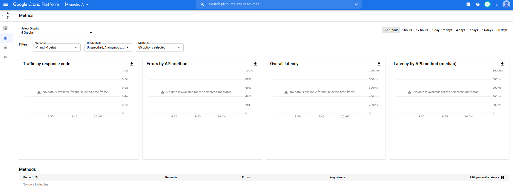
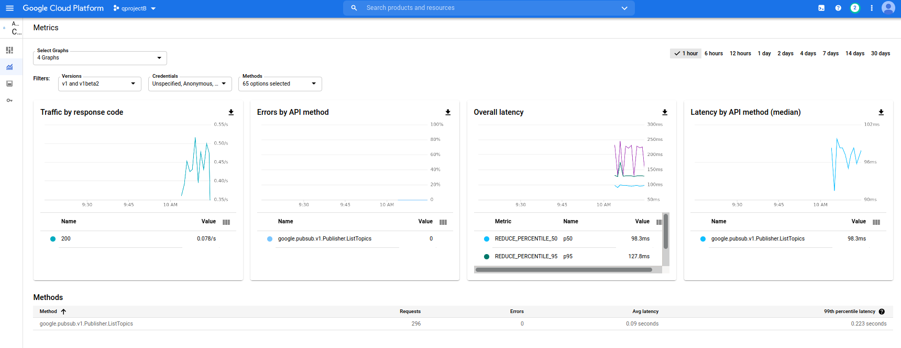
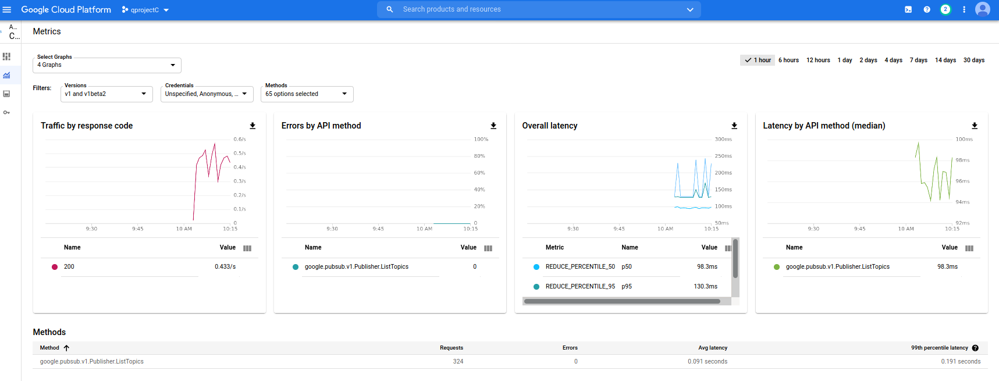

## GCP Quota and Cost Distribution between Projects

Simple gRPC interceptors that will distribute GCP API quota (and costs) between N projects.

I wrote this up just as a hack that spreads short-term quota limits (eg, requests/second) between N different projects.

The example here uses PubSub but the requests/second here isn't even relevant or is so high to not make a difference (see [PubSub Quota](https://cloud.google.com/pubsub/quotas))

You _could_ use this for gRPC GCP APIs where you want to control which projects consume quota at the _per rpc_ level.

The need to do that should be *very* rare...if you just want to distribute load, you should just use [option.WithQuotaProject()](https://pkg.go.dev/google.golang.org/api/option#WithQuotaProject) at the client level (not per-rpc)

Anyway, if you've read this so far...but i should say

> This repo is *not* supported by Google


in code, use module `"github.com/salrashid123/quota_shard"`

and set the interceptors directly when constructing the client

```golang
var (
	projectID     = "qprojecta"
	quotaProjects = []string{"qprojectb", "qprojectc"}
)

...
	ctx := context.Background()
	client, err := pubsub.NewClient(ctx, projectID, option.WithGRPCDialOption(grpc.WithUnaryInterceptor(quota.NewQuotaUnaryHandler(&quota.QuotaHandlerConfig{
		Projects: quotaProjects,
	}))), option.WithGRPCDialOption(grpc.WithStreamInterceptor(quota.NewQuotaStreamingHandler(&quota.QuotaHandlerConfig{
		Projects: quotaProjects,
	}))))
	if err != nil {
		fmt.Printf("Could not create pubsub Client: %v", err)
		return
	}
```

If you want to set this individually per rpc:

```golang
	newCtx := context.WithValue(ctx, quota.ClientMetadataKey(quota.QuotaProjectKey), "PROJECT_B")
	topics := client.Topics(newCtx)
	for {
		topic, err := topics.Next()
		if err == iterator.Done {
			break
		}
		if err != nil {
			fmt.Printf("Error listing topics %v", err)
			return
		}
		fmt.Println(topic)
	}
```

### Example Setup

If your ADC is using _user credentials_, the first step is to remove the `quota_project_id` value in the ADC config if you are using your own user-login

```bash
$ more ~/.config/gcloud/application_default_credentials.json
{
  "client_id": "...",
  "client_secret": "",
  "quota_project_id": "...",
  "refresh_token": "",
  "type": "authorized_user"
}
```

This is simply due to a bug in our google-auth golang library: it always ignores metadata overrides you specify in code and instead uses the value in this file.

first 

Create three projects: `A`,`B`,`C`

```bash
gcloud auth application-default login
export USER=`gcloud config get-value core/account`

# enable the api on all the projects involved
gcloud services enable pubsub.googleapis.com --project $PROJECT_A
gcloud services enable pubsub.googleapis.com --project $PROJECT_B
gcloud services enable pubsub.googleapis.com --project $PROJECT_C

# create a topic in projectA
gcloud pubsub topics create topic_A --project $PROJECT_A

# allow the adc user/service account access to list topics
gcloud projects  add-iam-policy-binding   --role=roles/pubsub.viewer   --member=user:$USER  $PROJECT_A

# allow the current user to use the project_b and project_c
gcloud projects  add-iam-policy-binding   --role=roles/serviceusage.serviceUsageConsumer   --member=user:$USER  $PROJECT_B
gcloud projects  add-iam-policy-binding   --role=roles/serviceusage.serviceUsageConsumer   --member=user:$USER  $PROJECT_C

# if using user credentials, run the following and remember to remove the `quota_project_id`
gcloud auth application-default login
```

If you run this in a loop, you'll see `A` does not consume any quota but `B` and `C` do

- `Project_A`


- `Project_B`


- `Project_C`
